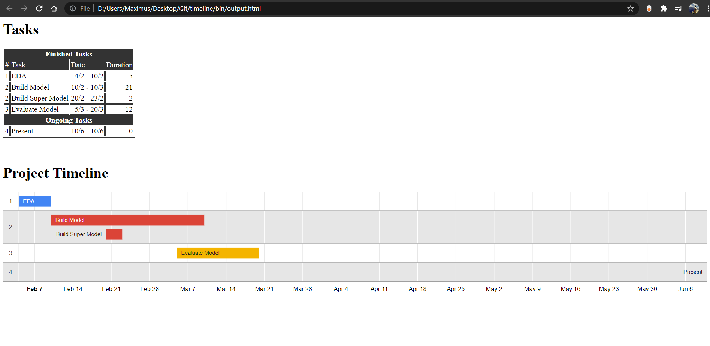
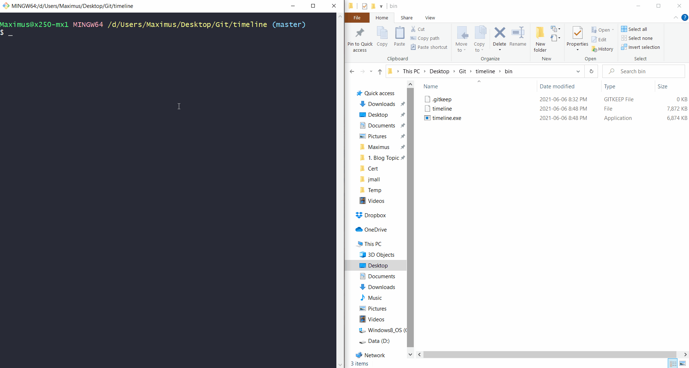

# Table of Contents

1. [Timeline](#timeline)
2. [Installation](#installation)
3. [Usage](#usage)
4. [Supported Formats](#support-format)
5. [Demo](#demo)

# Timeline

Timeline helps to quickly generate a Gantt chart with Google Timeline js library and a csv file. It is designed to build a minimalistic Gantt chart, so you can stay focus and keep your project schedule updated.

There have been times that I wish I could spend less effort on discussing and modifying the timeline. This tool is just for that.

<br/>
It provides 3 features <br/>

1. Create a Gantt chart
1. List the **finished** and **ongoing** tasks
1. Calculate the man-day (exclude Sun and Sat)


# Installation

### Binary
Generally it is not a good idea to download the binary file directly from anywhere on the web. But if you do not have Go environment setup, you can download the compiled file here.

| Operating System | Binary                   |
|------------------|--------------------------|
| Windows          | [Here](bin/timeline.exe) |
| Linux (Ubuntu)   | [Here](bin/timeline)     |

### Source
Or you can just install it with `go install` from the source

```
git clone https://github.com/billylkc/timeline
cd timeline
go install .
```

# Usage
0. Generate help on the commands with `-h` or `--help`<br/>
   Inside `./bin` directory, call program with `timeline` on Linux or `timeline.exe` on Windows.
   ```
   timeline -h
   timeline generate -h
   timeline create -h
   ```
   <br/>

1. Generate a sample input file - sample.csv <br/>
   `
   timeline generate csv
   `
   <br/>

1. Update the content in the csv file
   ```
   sample.csv

   Seq,Title,Start,End
   1,EDA,2021-02-04,2021-02-10
   2,Build Model,2021-02-10,2021-03-10
   2,Build Super Model,2021-02-20,2021-02-23
   3,Evaluate Model,2021-03-05,2021-03-20
   4,Present,2021-06-10,2021-06-10
   ```
   <br/>

1. Create the timeline html file <br/>
   `
   timeline create -i sample.csv -o output.html
   `
   <br/>

1. Output file <br/><br/>
   |  |
   |--------------------------------|

   <br/>

# Supported Format
- csv
- json
- toml (maybe)

# Demo



# To do
1. Support toml format
1. Add future event in the sample csv
1. Review css
1. Break task by week
1. Insert ongoing tasks in sample


## Reference
Google Timeline Chart - [Here](https://developers.google.com/chart/interactive/docs/gallery/timeline)

## Contributing
Pull requests are welcome. For major changes, please open an issue first to discuss what you would like to change.

Please make sure to update tests as appropriate.

## License
[Apache License 2.0](./LICENSE)
